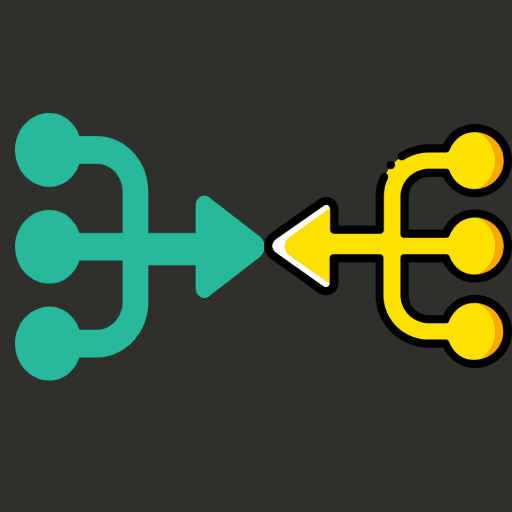

[![MIT License][license-shield]][license-url]

<!-- PROJECT LOGO -->
<br />
<p align="center">
  <a href="#">
    
  </a>

  <h3 align="center">Universal GPG File Merger</h3>

  <p align="center">
    Universal Desktop Software that merge all your GPG Files in one ! 
<p align="center">Compatible Windows / Linux / Mac OS</p>
    <br />
  </p>
</p>

<!-- TABLE OF CONTENTS -->
<details open="open">
  <summary>Table of Contents</summary>
  <ol>
    <li>
      <a href="#about-the-project">About The Project</a>
      <ul>
        <li><a href="#built-with">Built With</a></li>
      </ul>
    </li>
    <li>
      <a href="#getting-started">Getting Started</a>
      <ul>
        <li><a href="#prerequisites">Prerequisites</a></li>
        <li><a href="#installation">Installation</a></li>
      </ul>
    </li>
    <li><a href="#usage">Usage</a></li>
    <li><a href="#roadmap">Roadmap</a></li>
    <li><a href="#contributing">Contributing</a></li>
    <li><a href="#license">License</a></li>
    <li><a href="#contact">Contact</a></li>
  </ol>
</details>


<!-- ABOUT THE PROJECT -->
## About The Project

This project started by a family member requirements for its personal use only... at the beginning it was a simple but rather long bash script :). The aim is to merge multiple .gpg files in one sigular gpg files with a proper spacing and indentation.

I decided to create a small GUI to avoid any scripting tasks. 

Basically you can add gpg files as much as you want, either by Dragging & Dropping or by simply adding them via the dialog box. Once this is done, you can click "Merge gpg files". 

This step depending if you are on Mac OS or Linux will vary, but it basically decrypt the content of all files and them merge them into one. Once this step is done, it encrypt the merged file and display it to you.

Beware that you need to have GPG installed in your computer and with valid GPG keys inside your GPG Key manager for this software to work.

### Built With

This section should list any major frameworks that you built your project using. Leave any add-ons/plugins for the acknowledgements section. Here are a few examples.

* [ElectronJS](https://www.electronjs.org/)

<!-- GETTING STARTED -->
## Getting Started

### Prerequisites

I repeat again here, but make sure GPG is installed on your system and that you have valid keys or create ones.

This is an example of how to list things you need to use the software and how to install them.
* npm
  ```sh
  npm install npm@latest -g
  npm start
  ```
The App should launch as per below (with a files list empty of course :)).

##### Mac OS Screen


#### Linux Screen


#### Windows Screen
 Word in Progress

### Installation

<!-- ROADMAP -->
## Roadmap

See the [open issues](https://github.com/mohamed-arradi/GPGFileMerger/issues) for a list of proposed features (and known issues).

<!-- CONTRIBUTING -->
## Contributing

Contributions are what make the open source community such an amazing place to learn, inspire, and create. Any contributions you make are **greatly appreciated**.

1. Fork the Project
2. Create your Feature Branch (`git checkout -b feature/AmazingFeature`)
3. Commit your Changes (`git commit -m 'Add some AmazingFeature'`)
4. Push to the Branch (`git push origin feature/AmazingFeature`)
5. Open a Pull Request

<!-- LICENSE -->
## License

Distributed under the MIT License. See `LICENSE` for more information.


<!-- CONTACT -->
## Contact

Mohamed Arradi Alaoui - [@arradimohamed](https://twitter.com/arradimohamed) - hello@arradimohamed.fr


<!-- MARKDOWN LINKS & IMAGES -->
<!-- https://www.markdownguide.org/basic-syntax/#reference-style-links -->
[license-shield]: https://img.shields.io/github/license/othneildrew/Best-README-Template.svg?style=for-the-badge
[license-url]: https://github.com/mohamed-arradi/GPGFileMerger/blob/main/LICENSE